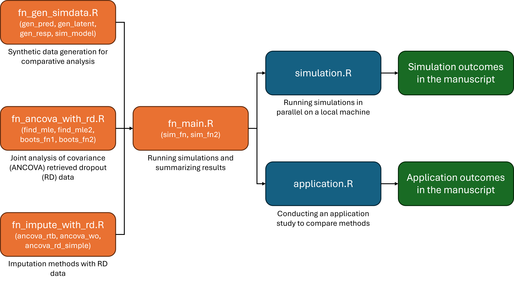

# RDancova

This repository contains R scripts with functions and code to reproduce all tables and figures presented in the manuscript "_Estimation of Treatment Effect in Clinical Trials of Continuous Endpoints with Retrieved Dropouts_," authored by [Myeongjong Kang](https://github.com/myeongjong) and [Sangyoon Yi](https://github.com/sangyoonstat). For any questions, please feel free to contact one of the authors.

## Code organization

The code structure is organized into three layers: function definition scripts (orange), execution scripts (blue), and manuscript outputs (green). The orange boxes (fn_gen_simdata.R, fn_ancova_with_rd.R, fn_main.R, and fn_impute_with_rd.R) contain core functions for data generation, model estimation and inference, and comparator methods. These functions are utilized by the blue execution scripts, simulation.R and application.R, which perform simulation studies and real data analysis, respectively. The overall workflow is visualized in the flowchart below.

## Reference

TBA